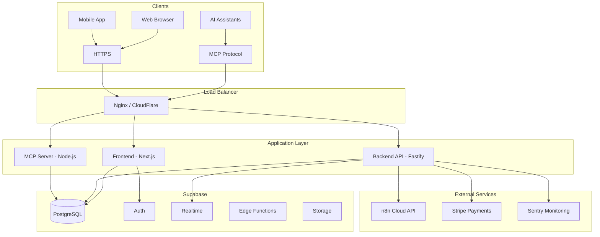
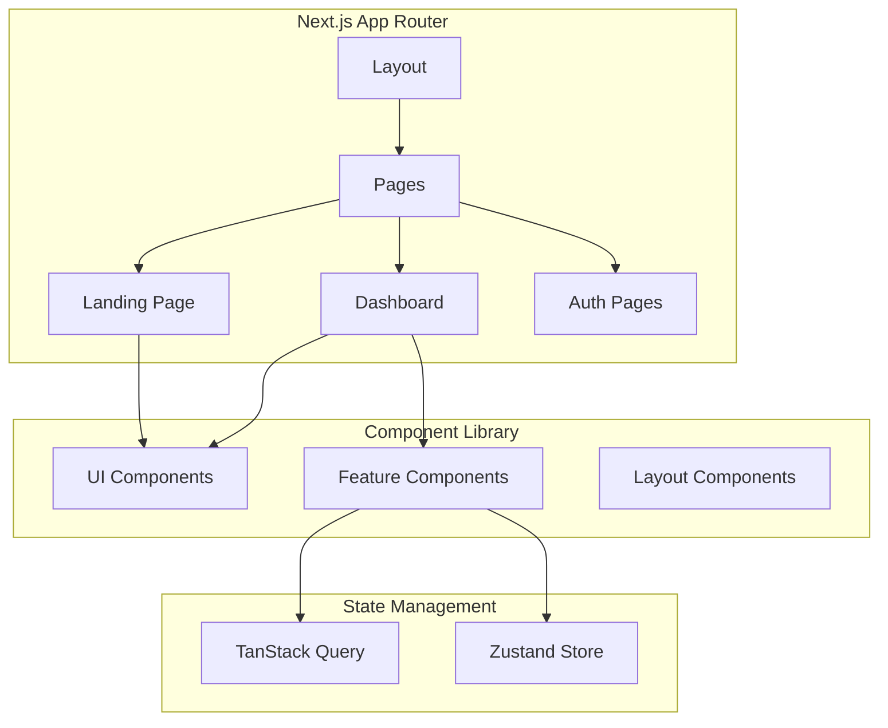
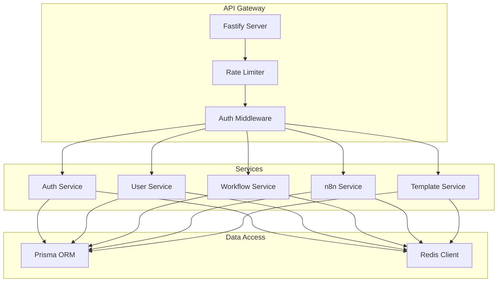
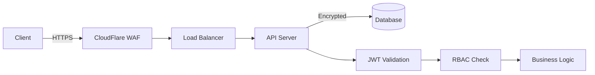

# 🏗️ Technical Architecture

## System Overview



---

## Component Architecture

### Frontend Architecture



### Backend Architecture



---

## Technology Decisions

### Frontend Stack

| Technology | Purpose | Justification |
|------------|---------|---------------|
| Next.js 14+ | Framework | App Router, SSR, API routes |
| Tailwind CSS | Styling | Rapid development, consistent design |
| shadcn/ui | Components | Accessible, customizable |
| TanStack Query | Data fetching | Caching, mutations, real-time |
| Zustand | State | Simple, TypeScript-friendly |
| Framer Motion | Animations | Smooth, performant |

### Backend Stack

| Technology | Purpose | Justification |
|------------|---------|---------------|
| Node.js 20+ | Runtime | Modern features, performance |
| Fastify | Framework | Fast, TypeScript support |
| TypeScript | Language | Type safety, better DX |
| PostgreSQL | Database | Reliable, feature-rich |
| Prisma | ORM | Type-safe, migrations |
| Redis | Cache | Fast, pub/sub support |

---

## Security Architecture



### Security Measures

- **Authentication**: JWT with refresh token rotation
- **Authorization**: Role-Based Access Control (RBAC)
- **Encryption**: TLS 1.3, AES-256 at rest
- **API Security**: Rate limiting, CORS, CSRF protection
- **Secrets**: HashiCorp Vault / AWS Secrets Manager

---

## Scalability Strategy

### Horizontal Scaling

```
                    ┌─────────────┐
                    │   Nginx LB  │
                    └──────┬──────┘
           ┌───────────────┼───────────────┐
           │               │               │
    ┌──────▼──────┐ ┌──────▼──────┐ ┌──────▼──────┐
    │  API Pod 1  │ │  API Pod 2  │ │  API Pod 3  │
    └──────┬──────┘ └──────┬──────┘ └──────┬──────┘
           │               │               │
           └───────────────┼───────────────┘
                           │
              ┌────────────┼────────────┐
       ┌──────▼──────┐          ┌──────▼──────┐
       │  PostgreSQL │          │    Redis    │
       │   Primary   │          │   Cluster   │
       └──────┬──────┘          └─────────────┘
              │
       ┌──────▼──────┐
       │  Read Replica│
       └─────────────┘
```

### Caching Strategy

| Layer | Technology | TTL | Use Case |
|-------|------------|-----|----------|
| CDN | CloudFlare | 24h | Static assets |
| API | Redis | 1h | Node data, templates |
| Database | Query cache | 5m | Frequent queries |

---

## Monitoring & Observability

### Metrics Stack

- **APM**: DataDog / New Relic
- **Logs**: Winston → CloudWatch / ELK
- **Errors**: Sentry
- **Uptime**: UptimeRobot
- **Alerts**: PagerDuty

### Key Metrics

- API response time (P95 < 200ms)
- Error rate (< 0.1%)
- Uptime (99.9%)
- User sessions
- API call volume
