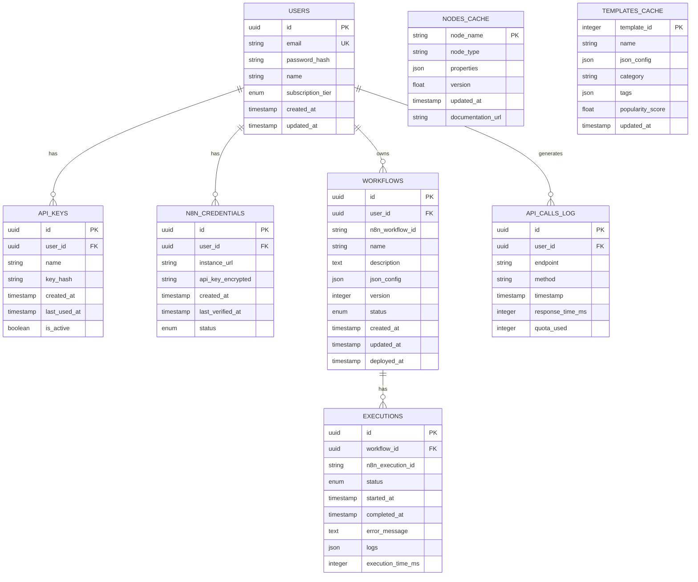

# 🗄️ Database Schema (Supabase)

## Overview

نستخدم **Supabase** كـ Backend-as-a-Service مع:
- **PostgreSQL** - قاعدة البيانات الرئيسية
- **Row Level Security (RLS)** - حماية البيانات
- **Realtime** - تحديثات فورية
- **Edge Functions** - Serverless functions
- **Storage** - تخزين الملفات
- **Auth** - نظام المصادقة المدمج

---




---

## Table Definitions

### users

```sql
CREATE TABLE users (
    id UUID PRIMARY KEY DEFAULT gen_random_uuid(),
    email VARCHAR(255) UNIQUE NOT NULL,
    password_hash VARCHAR(255) NOT NULL,
    name VARCHAR(255),
    subscription_tier VARCHAR(20) DEFAULT 'free' CHECK (subscription_tier IN ('free', 'supporter', 'enterprise')),
    stripe_customer_id VARCHAR(255),
    created_at TIMESTAMP WITH TIME ZONE DEFAULT NOW(),
    updated_at TIMESTAMP WITH TIME ZONE DEFAULT NOW()
);

CREATE INDEX idx_users_email ON users(email);
CREATE INDEX idx_users_subscription ON users(subscription_tier);
```

### api_keys

```sql
CREATE TABLE api_keys (
    id UUID PRIMARY KEY DEFAULT gen_random_uuid(),
    user_id UUID NOT NULL REFERENCES users(id) ON DELETE CASCADE,
    name VARCHAR(255) NOT NULL,
    key_hash VARCHAR(255) NOT NULL,
    created_at TIMESTAMP WITH TIME ZONE DEFAULT NOW(),
    last_used_at TIMESTAMP WITH TIME ZONE,
    is_active BOOLEAN DEFAULT true
);

CREATE INDEX idx_api_keys_user ON api_keys(user_id);
CREATE INDEX idx_api_keys_hash ON api_keys(key_hash);
```

### n8n_credentials

```sql
CREATE TABLE n8n_credentials (
    id UUID PRIMARY KEY DEFAULT gen_random_uuid(),
    user_id UUID NOT NULL REFERENCES users(id) ON DELETE CASCADE,
    instance_url VARCHAR(500) NOT NULL,
    api_key_encrypted TEXT NOT NULL,
    status VARCHAR(20) DEFAULT 'pending' CHECK (status IN ('pending', 'verified', 'failed')),
    created_at TIMESTAMP WITH TIME ZONE DEFAULT NOW(),
    last_verified_at TIMESTAMP WITH TIME ZONE
);

CREATE INDEX idx_n8n_creds_user ON n8n_credentials(user_id);
```

### workflows

```sql
CREATE TABLE workflows (
    id UUID PRIMARY KEY DEFAULT gen_random_uuid(),
    user_id UUID NOT NULL REFERENCES users(id) ON DELETE CASCADE,
    n8n_workflow_id VARCHAR(255),
    name VARCHAR(255) NOT NULL,
    description TEXT,
    json_config JSONB NOT NULL,
    version INTEGER DEFAULT 1,
    status VARCHAR(20) DEFAULT 'draft' CHECK (status IN ('draft', 'active', 'inactive', 'error')),
    created_at TIMESTAMP WITH TIME ZONE DEFAULT NOW(),
    updated_at TIMESTAMP WITH TIME ZONE DEFAULT NOW(),
    deployed_at TIMESTAMP WITH TIME ZONE
);

CREATE INDEX idx_workflows_user ON workflows(user_id);
CREATE INDEX idx_workflows_status ON workflows(status);
CREATE INDEX idx_workflows_n8n_id ON workflows(n8n_workflow_id);
```

### executions

```sql
CREATE TABLE executions (
    id UUID PRIMARY KEY DEFAULT gen_random_uuid(),
    workflow_id UUID NOT NULL REFERENCES workflows(id) ON DELETE CASCADE,
    n8n_execution_id VARCHAR(255),
    status VARCHAR(20) NOT NULL CHECK (status IN ('running', 'success', 'error', 'cancelled')),
    started_at TIMESTAMP WITH TIME ZONE DEFAULT NOW(),
    completed_at TIMESTAMP WITH TIME ZONE,
    error_message TEXT,
    logs JSONB,
    execution_time_ms INTEGER
);

CREATE INDEX idx_executions_workflow ON executions(workflow_id);
CREATE INDEX idx_executions_status ON executions(status);
CREATE INDEX idx_executions_started ON executions(started_at DESC);
```

### nodes_cache

```sql
CREATE TABLE nodes_cache (
    node_name VARCHAR(255) PRIMARY KEY,
    node_type VARCHAR(100),
    display_name VARCHAR(255),
    description TEXT,
    properties JSONB,
    version FLOAT,
    documentation_url VARCHAR(500),
    updated_at TIMESTAMP WITH TIME ZONE DEFAULT NOW()
);

CREATE INDEX idx_nodes_type ON nodes_cache(node_type);
```

### templates_cache

```sql
CREATE TABLE templates_cache (
    template_id INTEGER PRIMARY KEY,
    name VARCHAR(255) NOT NULL,
    description TEXT,
    json_config JSONB NOT NULL,
    category VARCHAR(100),
    tags JSONB,
    popularity_score FLOAT DEFAULT 0,
    updated_at TIMESTAMP WITH TIME ZONE DEFAULT NOW()
);

CREATE INDEX idx_templates_category ON templates_cache(category);
CREATE INDEX idx_templates_popularity ON templates_cache(popularity_score DESC);
```

### api_calls_log

```sql
CREATE TABLE api_calls_log (
    id UUID PRIMARY KEY DEFAULT gen_random_uuid(),
    user_id UUID NOT NULL REFERENCES users(id) ON DELETE CASCADE,
    endpoint VARCHAR(255) NOT NULL,
    method VARCHAR(10) NOT NULL,
    timestamp TIMESTAMP WITH TIME ZONE DEFAULT NOW(),
    response_time_ms INTEGER,
    status_code INTEGER,
    quota_used INTEGER DEFAULT 1
);

CREATE INDEX idx_api_calls_user ON api_calls_log(user_id);
CREATE INDEX idx_api_calls_timestamp ON api_calls_log(timestamp DESC);

-- Partition by month for large-scale
CREATE INDEX idx_api_calls_user_date ON api_calls_log(user_id, DATE(timestamp));
```

---

## Prisma Schema

```prisma
// prisma/schema.prisma

generator client {
  provider = "prisma-client-js"
}

datasource db {
  provider = "postgresql"
  url      = env("DATABASE_URL")
}

enum SubscriptionTier {
  free
  supporter
  enterprise
}

enum WorkflowStatus {
  draft
  active
  inactive
  error
}

enum ExecutionStatus {
  running
  success
  error
  cancelled
}

model User {
  id               String           @id @default(uuid())
  email            String           @unique
  passwordHash     String           @map("password_hash")
  name             String?
  subscriptionTier SubscriptionTier @default(free) @map("subscription_tier")
  stripeCustomerId String?          @map("stripe_customer_id")
  createdAt        DateTime         @default(now()) @map("created_at")
  updatedAt        DateTime         @updatedAt @map("updated_at")
  
  apiKeys         ApiKey[]
  n8nCredentials  N8nCredential[]
  workflows       Workflow[]
  apiCalls        ApiCallLog[]
  
  @@map("users")
}

model ApiKey {
  id         String    @id @default(uuid())
  userId     String    @map("user_id")
  name       String
  keyHash    String    @map("key_hash")
  createdAt  DateTime  @default(now()) @map("created_at")
  lastUsedAt DateTime? @map("last_used_at")
  isActive   Boolean   @default(true) @map("is_active")
  
  user User @relation(fields: [userId], references: [id], onDelete: Cascade)
  
  @@map("api_keys")
}

model Workflow {
  id            String         @id @default(uuid())
  userId        String         @map("user_id")
  n8nWorkflowId String?        @map("n8n_workflow_id")
  name          String
  description   String?
  jsonConfig    Json           @map("json_config")
  version       Int            @default(1)
  status        WorkflowStatus @default(draft)
  createdAt     DateTime       @default(now()) @map("created_at")
  updatedAt     DateTime       @updatedAt @map("updated_at")
  deployedAt    DateTime?      @map("deployed_at")
  
  user       User        @relation(fields: [userId], references: [id], onDelete: Cascade)
  executions Execution[]
  
  @@map("workflows")
}

model Execution {
  id              String          @id @default(uuid())
  workflowId      String          @map("workflow_id")
  n8nExecutionId  String?         @map("n8n_execution_id")
  status          ExecutionStatus
  startedAt       DateTime        @default(now()) @map("started_at")
  completedAt     DateTime?       @map("completed_at")
  errorMessage    String?         @map("error_message")
  logs            Json?
  executionTimeMs Int?            @map("execution_time_ms")
  
  workflow Workflow @relation(fields: [workflowId], references: [id], onDelete: Cascade)
  
  @@map("executions")
}
```

---

## Indexes Strategy

| Table | Index | Purpose |
|-------|-------|---------|
| users | email | Login lookup |
| api_keys | key_hash | API auth |
| workflows | user_id, status | Dashboard queries |
| executions | workflow_id, started_at | History lookup |
| api_calls_log | user_id, timestamp | Quota calculation |

---

## Supabase Setup

### Environment Variables

```env
# Supabase
NEXT_PUBLIC_SUPABASE_URL=https://your-project.supabase.co
NEXT_PUBLIC_SUPABASE_ANON_KEY=eyJ...
SUPABASE_SERVICE_ROLE_KEY=eyJ...
```

### Supabase Client

```typescript
// lib/supabase/client.ts
import { createBrowserClient } from '@supabase/ssr'

export function createClient() {
  return createBrowserClient(
    process.env.NEXT_PUBLIC_SUPABASE_URL!,
    process.env.NEXT_PUBLIC_SUPABASE_ANON_KEY!
  )
}
```

```typescript
// lib/supabase/server.ts
import { createServerClient } from '@supabase/ssr'
import { cookies } from 'next/headers'

export async function createClient() {
  const cookieStore = await cookies()
  
  return createServerClient(
    process.env.NEXT_PUBLIC_SUPABASE_URL!,
    process.env.NEXT_PUBLIC_SUPABASE_ANON_KEY!,
    {
      cookies: {
        getAll() {
          return cookieStore.getAll()
        },
        setAll(cookiesToSet) {
          cookiesToSet.forEach(({ name, value, options }) =>
            cookieStore.set(name, value, options)
          )
        },
      },
    }
  )
}
```

---

## Row Level Security (RLS)

### Enable RLS

```sql
-- Enable RLS on all tables
ALTER TABLE users ENABLE ROW LEVEL SECURITY;
ALTER TABLE api_keys ENABLE ROW LEVEL SECURITY;
ALTER TABLE n8n_credentials ENABLE ROW LEVEL SECURITY;
ALTER TABLE workflows ENABLE ROW LEVEL SECURITY;
ALTER TABLE executions ENABLE ROW LEVEL SECURITY;
ALTER TABLE api_calls_log ENABLE ROW LEVEL SECURITY;
```

### RLS Policies

```sql
-- Users: can only see/update own profile
CREATE POLICY "Users can view own profile"
  ON users FOR SELECT
  USING (auth.uid() = id);

CREATE POLICY "Users can update own profile"
  ON users FOR UPDATE
  USING (auth.uid() = id);

-- API Keys: user can manage own keys
CREATE POLICY "Users can manage own API keys"
  ON api_keys FOR ALL
  USING (auth.uid() = user_id);

-- Workflows: user can manage own workflows
CREATE POLICY "Users can manage own workflows"
  ON workflows FOR ALL
  USING (auth.uid() = user_id);

-- Executions: user can view executions of own workflows
CREATE POLICY "Users can view own workflow executions"
  ON executions FOR SELECT
  USING (
    workflow_id IN (
      SELECT id FROM workflows WHERE user_id = auth.uid()
    )
  );

-- n8n Credentials: user can manage own credentials
CREATE POLICY "Users can manage own n8n credentials"
  ON n8n_credentials FOR ALL
  USING (auth.uid() = user_id);

-- API Calls Log: user can view own logs
CREATE POLICY "Users can view own API calls"
  ON api_calls_log FOR SELECT
  USING (auth.uid() = user_id);
```

---

## Supabase Realtime

### Enable Realtime

```sql
-- Enable realtime for executions table
ALTER PUBLICATION supabase_realtime ADD TABLE executions;
```

### Subscribe to Changes

```typescript
// Subscribe to execution updates
const supabase = createClient()

const channel = supabase
  .channel('executions')
  .on(
    'postgres_changes',
    {
      event: '*',
      schema: 'public',
      table: 'executions',
      filter: `workflow_id=eq.${workflowId}`
    },
    (payload) => {
      console.log('Execution update:', payload)
    }
  )
  .subscribe()
```

---

## Edge Functions

### Validate Workflow Function

```typescript
// supabase/functions/validate-workflow/index.ts
import { serve } from 'https://deno.land/std@0.168.0/http/server.ts'

serve(async (req) => {
  const { workflow } = await req.json()
  
  // Validation logic
  const errors = []
  
  if (!workflow.nodes || workflow.nodes.length === 0) {
    errors.push({ message: 'Workflow must have at least one node' })
  }
  
  return new Response(
    JSON.stringify({ valid: errors.length === 0, errors }),
    { headers: { 'Content-Type': 'application/json' } }
  )
})
```

---

## Database Functions

### Get User Quota

```sql
CREATE OR REPLACE FUNCTION get_user_quota(p_user_id UUID)
RETURNS TABLE (
  calls_today INTEGER,
  calls_limit INTEGER,
  reset_at TIMESTAMPTZ
) AS $$
BEGIN
  RETURN QUERY
  SELECT 
    COUNT(*)::INTEGER as calls_today,
    CASE 
      WHEN u.subscription_tier = 'supporter' THEN 999999
      ELSE 100
    END as calls_limit,
    (DATE_TRUNC('day', NOW()) + INTERVAL '1 day')::TIMESTAMPTZ as reset_at
  FROM api_calls_log acl
  JOIN users u ON u.id = p_user_id
  WHERE acl.user_id = p_user_id
    AND acl.timestamp >= DATE_TRUNC('day', NOW())
  GROUP BY u.subscription_tier;
END;
$$ LANGUAGE plpgsql SECURITY DEFINER;
```

---

## Supabase Auth Integration

### User Table Trigger

```sql
-- Auto-create user profile on signup
CREATE OR REPLACE FUNCTION public.handle_new_user()
RETURNS TRIGGER AS $$
BEGIN
  INSERT INTO public.users (id, email, name)
  VALUES (
    NEW.id,
    NEW.email,
    NEW.raw_user_meta_data->>'name'
  );
  RETURN NEW;
END;
$$ LANGUAGE plpgsql SECURITY DEFINER;

CREATE TRIGGER on_auth_user_created
  AFTER INSERT ON auth.users
  FOR EACH ROW EXECUTE FUNCTION public.handle_new_user();
```

