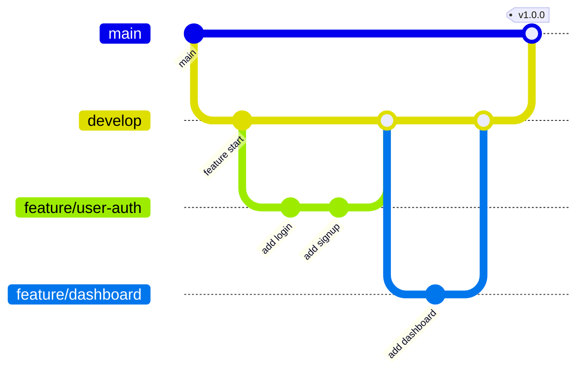

# 💻 Development Workflow

## Quick Start

```bash
# Clone & Install
git clone https://github.com/your-org/n8n-mcp.git
cd n8n-mcp
npm install

# Setup environment
cp .env.example .env
# Edit .env with your values

# Start database
docker-compose up -d postgres redis

# Run migrations
npm run db:migrate

# Start development
npm run dev
```

---

## Project Scripts

```json
{
  "dev": "turbo run dev",
  "build": "turbo run build",
  "test": "turbo run test",
  "lint": "turbo run lint",
  "db:migrate": "prisma migrate dev",
  "db:seed": "prisma db seed",
  "db:studio": "prisma studio"
}
```

---

## Git Workflow



### Branch Naming

- `feature/` - New features
- `fix/` - Bug fixes
- `docs/` - Documentation
- `refactor/` - Code refactoring

### Commit Convention

```
feat: add user authentication
fix: resolve login redirect issue
docs: update API documentation
refactor: simplify workflow validation
```

---

## Testing Strategy

```
tests/
├── unit/           # Unit tests (Jest)
├── integration/    # API tests (Supertest)
└── e2e/           # E2E tests (Playwright)
```

### Running Tests

```bash
# Unit tests
npm run test

# Integration tests
npm run test:integration

# E2E tests
npm run test:e2e

# Coverage report
npm run test:coverage
```

---

## Code Quality

### Pre-commit Hooks (Husky)

```bash
# Runs on every commit
- ESLint check
- Prettier format
- TypeScript check
- Unit tests
```

### ESLint Rules

- No unused variables
- Consistent imports
- TypeScript strict mode

---

## Debugging

### VS Code Launch Config

```json
{
  "configurations": [
    {
      "name": "Debug Backend",
      "type": "node",
      "request": "launch",
      "program": "${workspaceFolder}/backend/src/index.ts"
    }
  ]
}
```

### Useful Commands

```bash
# Check logs
npm run logs

# Database console
npx prisma studio

# Redis CLI
docker exec -it redis redis-cli
```

---

## Documentation Updates

When making changes:
1. Update relevant docs
2. Update CHANGELOG.md
3. Update API specs if endpoints change
4. Update tests
